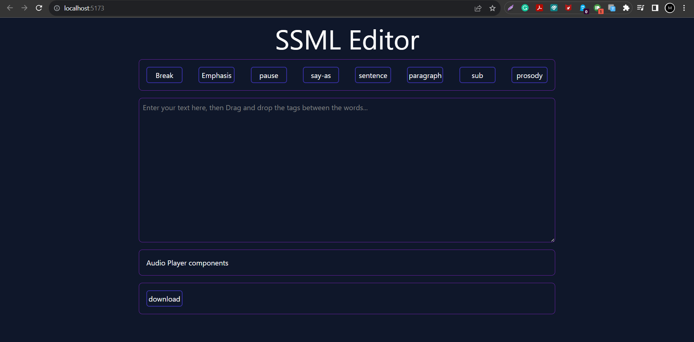
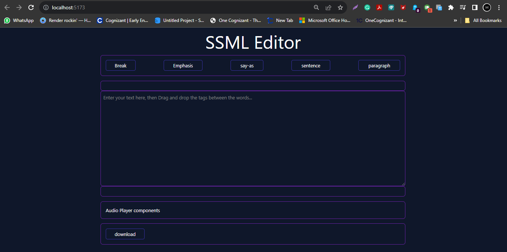
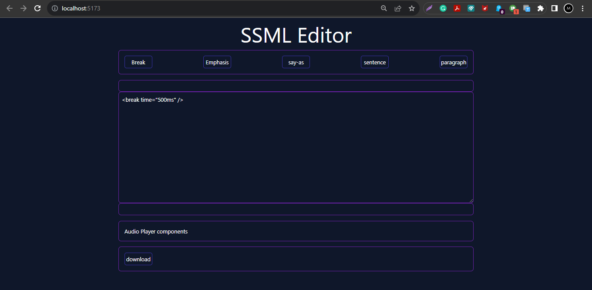
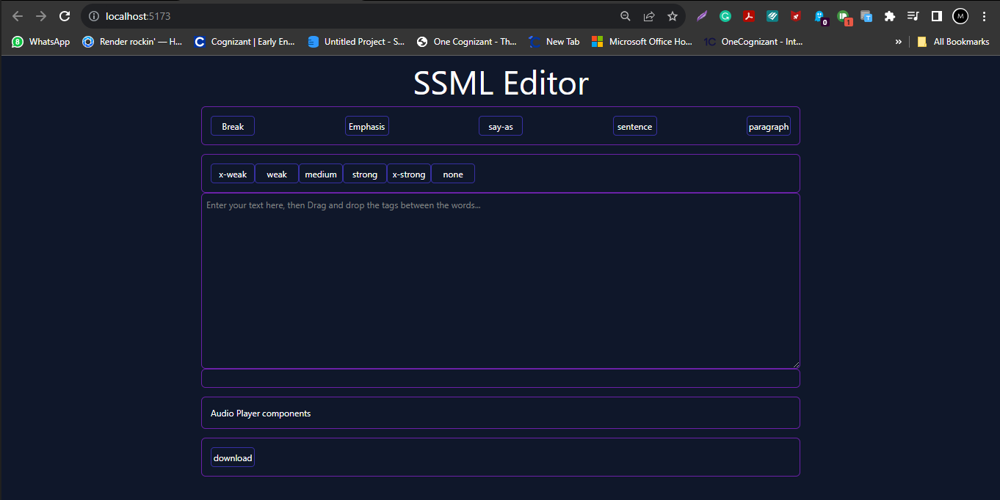
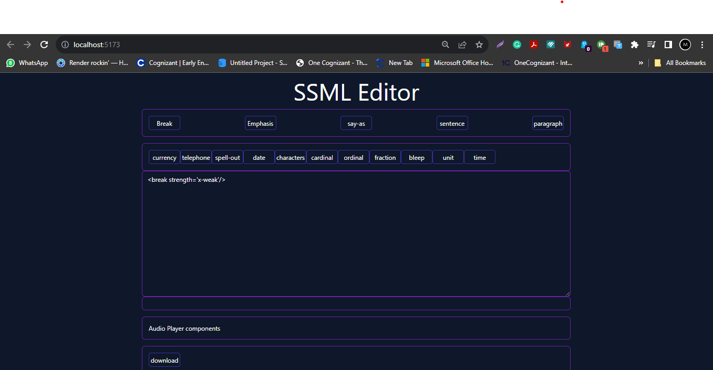
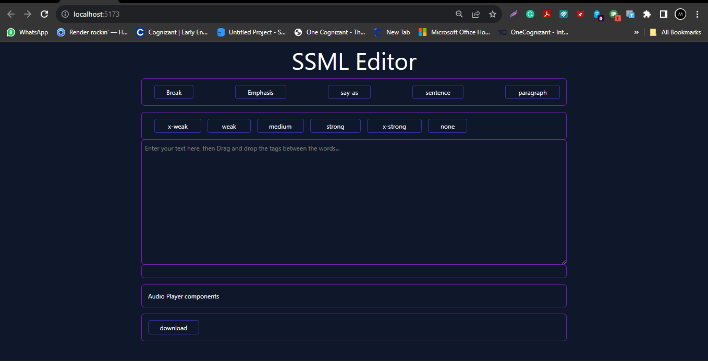

# React + Vite

This template provides a minimal setup to get React working in Vite with HMR and some ESLint rules.

Currently, two official plugins are available:

- [@vitejs/plugin-react](https://github.com/vitejs/vite-plugin-react/blob/main/packages/plugin-react/README.md) uses [Babel](https://babeljs.io/) for Fast Refresh
- [@vitejs/plugin-react-swc](https://github.com/vitejs/vite-plugin-react-swc) uses [SWC](https://swc.rs/) for Fast Refresh
- 
- 
--- 


Heading
Tag container - add tag buttons
text Area Container
Play Audio Container
Language, Voices, and Download Button Container

Flow:
Type/ add text into Text Area
Drag the buttons make the copy (onion skin), and drop it between the desired word/letter etc. need to see that button getting added into text box.
once satisfyed.click on playButton which will convert the text with ssml tags into audio and play to the user.Also has option to change Language/ voices/ and download.


-----------------

npm create vite@latest
√ Project name: ... ssml-editor
√ Select a framework: » React
√ Select a variant: » JavaScript

cd ssml-editor
npm install
npm run dev

npm install tailwindcss

npx tailwindcss init -p

npm run dev

ISSUE : 
triggerUncaughtException(err, true /* fromPromise */);
            ^
[Failed to load PostCSS config: Failed to load PostCSS config (searchPath: D:/Learnings/React_JS/myProjects/ssml-editor): [Error] Loading PostCSS Plugin failed: Cannot find module 'autoprefixer'
Require stack: - D:\Learnings\React_JS\myProjects\ssml-editor\postcss.config.js

Solution : 
npm install autoprefixer --save-dev

```dotnetcli

export default {
  plugins: {
    tailwindcss: {},
    autoprefixer: {},
  },
}
```

```
/** @type {import('tailwindcss').Config} */
export default {
  content: [
    "./src/**/*.{js,jsx,ts,tsx}",
  ], //Added these
  theme: {
    extend: {},
  },
  plugins: [],
}
```

-----

## Components
Heading.js
Tags.js
TextArea.js
Audio.js
Download.js

> class component or functional component?
using Functional


 > i created button within border box div, but wasnt spacing between, by adding w-full it worked
 <div className='flex justify-between w-full'>


I have craeted Heading, tags Container having list of buttons.
You see the buttons are doing same job of rendering, but in tags it is mentioned in multiple lines.

```js
// App.js
import './index.css'
import Header from './components/Header'
import Tags from './components/Tags'

function App() {
  return (
    <>
      <div className='bg-slate-900 min-h-screen w-screen '>
        <div className='flex justify-center items center'>
          <Header></Header>
          <Tags></Tags>
        </div>
      </div>
    </>
  )
}

export default App
```

```js
// Tags.js
import React from 'react';
import Buttons from './Buttons';

const Tags = (props) => {
    const { buttons } = props;
    return (
        <div className='flex border border-solid border-purple-800 w-3/5 h-15 mt-4 rounded-lg p-4'>
            <div className='flex justify-between w-full  text-white'>
                <button className='rounded-md border-2 border-solid border-indigo-800 w-20 h-9 '>break</button>
                <button className='rounded-md border-2 border-solid border-indigo-800 w-20 h-9 '>emphasis</button>
                <button className='rounded-md border-2 border-solid border-indigo-800 w-20 h-9 '>pause</button>
                <button className='rounded-md border-2 border-solid border-indigo-800 w-20 h-9 '>say-as</button>
                <button className='rounded-md border-2 border-solid border-indigo-800 w-20 h-9 '>sentence</button>
                <button className='rounded-md border-2 border-solid border-indigo-800 w-20 h-9 '>paragraph</button>
                <button className='rounded-md border-2 border-solid border-indigo-800 w-20 h-9 '>sub</button>
                <button className='rounded-md border-2 border-solid border-indigo-800 w-20 h-9 '>prosody</button> 
            </div>
        </div>
    );
};

export default Tags;
```

---

Lets create a seperate component for buttons, and render under tags component.
We need to pass props with buttons list from App.js -> Tags.jsx -> Buttons.jsx
Lets create the list in App.jsx and pass it.

```js
// App.jsx
import './index.css'
import Header from './components/Header'
import Tags from './components/Tags'

function App() {

  const buttons = ['Break', 'Emphasis', 'pause', 'say-as', 'sentence', 'paragraph', 'sub', 'prosody'];
  return (
    <>
      <div className='bg-slate-900 min-h-screen w-screen '>
        <div className='flex justify-center'>
          <Header></Header>
          <Tags buttons={buttons}></Tags>
        </div>
      </div>
    </>
  )
}

export default App
```

```js
// Tags.jsx
import React from 'react';
import Buttons from './Buttons';

const Tags = (props) => {
    const { buttons } = props;
    return (
        <div className='flex border border-solid border-purple-800 w-3/5 h-15 mt-4 rounded-lg p-4'>
            <div className='flex justify-between w-full  text-white'>
                <Buttons buttons={buttons} />
            </div>
        </div>
    );
};

export default Tags;
```

```js
// Button.jsx
import React from 'react';

const Buttons = (props) => {
    const { buttons } = props;
    let tags = buttons.map((item) => {
        return (
            <button className='rounded-md border-2 border-solid border-indigo-800 w-20 h-9 '>{item}</button>
        );
    });


    return <>{tags}</>;
}

export default Buttons;
```

---- 
TextArea Creation

```js
// TextArea.jsx
import React from 'react';

const TextArea = () => {
    return (
        <textarea
            className="w-3/5 mt-4 h-80 p-2 border border-purple-800 rounded-lg bg-transparent text-white"
            placeholder="Enter your text here..." style={{ outline: 'none' }}
        ></textarea>
    );
};

export default TextArea;
```

Audio Component

```js
// Audio.jsx
import React from 'react'

export const Audio = () => {
  return (
      <div className='flex border border-solid border-purple-800 w-3/5 h-15 mt-4 rounded-lg p-4 text-white'>
        Audio Player components
      </div>
  )
}
```

## Download Component
// we will make re use of button.jsx to create buttons
We need to pass additional props for download button in App.jsx
under Download Component we will render the button

```js
//App.jsx
import './index.css'
import Header from './components/Header'
import Tags from './components/Tags'
import TextArea from './components/TextArea'
import { Audio } from './components/Audio'
import Download from './components/Download'

function App() {

  const buttons = {
    "tags": ['Break', 'Emphasis', 'pause', 'say-as', 'sentence', 'paragraph', 'sub', 'prosody'],
    "download": ['download']
  };

  console.log(buttons);

  return (
    <>
      <div className='bg-slate-900 min-h-screen w-screen '>
        <div className='flex flex-col justify-center items-center'>
          <Header></Header>
          <Tags buttons={buttons}></Tags>
          <TextArea />
          <Audio />
          <Download buttons={buttons} />
        </div>
      </div>
    </>
  )
}

export default App
```

```js
// Download.jsx
import React from 'react';
import Buttons from './Buttons';

const Download = (props) => {
    const { buttons } = props;
    const downloadButtton = buttons.download;
    return (
        <div className='flex border border-solid border-purple-800 w-3/5 h-15 mt-4 rounded-lg p-4 text-white'>
            <Buttons buttons={downloadButtton} />
        </div>
    );
}

export default Download;
```

----

## Added Key Id

`npm install uuid`

`import { v4 as uuidv4 } from 'uuid'`

```jS
// Buttons.js
import React from 'react';
import { v4 as uuidv4 } from 'uuid';


const Buttons = (props) => {

    const { buttons } = props;
    console.log(buttons)
    let tags = buttons.map((item) => {
        return (
            <button key={uuidv4()} className='rounded-md border-2 border-solid border-indigo-800 w-20 h-9'>{item}</button>
        );
    });

    return <>{tags}</>;
}

export default Buttons;
```
---

## Design Layout 




---

minor changes made in layout
Added a container above and below the textArea, thinking of adding all the attributes respective the main tags like `break` ->  x-weak,strong,medium.. etc
we can access all the additional attributes, drag and drop them to textArea.

Changes made in TextArea
```js
// TextArea.jsx
import React, { useState, useEffect } from 'react';
import Buttons from './Buttons';

const TextArea = ({ buttons}) => {
    return (
        <>
            <div id='tagAttributes' className='flex border border-solid border-purple-800 w-3/5 h-15 rounded-lg p-4 mt-4 text-white'>
            </div>
            <textarea
                className="w-3/5 h-80 p-2 border border-purple-800 rounded-lg bg-transparent text-white"
                placeholder="Enter your text here, then Drag and drop the tags between the words..." style={{ outline: 'none' }}
            ></textarea>
            <div className='flex border border-solid border-purple-800 w-3/5 h-15 rounded-lg p-4'></div>
        </>
    );
};
```



this means i need to add some more data into the props, lets move these data to the data.json file.

```json
    {
        "tags": [
            {
                "label": "Break",
                "ssmlTag": " <break time='500ms'/> ",
                "draggable": true
            },
            {
                "label": "Emphasis",
                "ssmlTag": " <emphasis>EMPHASISED TEXT</emphasis> ",
                "draggable": true
            },
            {
                "label": "say-as",
                "ssmlTag": " <say-as interpret-as='currency' language='en - US'>TEXT</say-as> ",
                "draggable": true
            },
            {
                "label": "sentence",
                "ssmlTag": " <s>SENTENCE</s> ",
                "draggable": true
            },
            {
                "label": "paragraph",
                "ssmlTag": " <p>PARAGRAPH</p> ",
                "draggable": true
            }
        ],
        "download": [
            {
                "label": "download",
                "draggable": false
            }
        ],
        "ssmlAttributes": {
            "Break": [
                {
                    "label": " x-weak",
                    "ssmlTag": " <break strength='x-weak'/> ",
                    "draggable": true
                },
                {
                    "label": " weak ",
                    "ssmlTag": " <break strength='weak'/> ",
                    "draggable": true
                },
                {
                    "label": " medium",
                    "ssmlTag": " <break strength='medium'/> ",
                    "draggable": true
                },
                {
                    "label": " strong ",
                    "ssmlTag": " <break strength='strong'/> ",
                    "draggable": true
                },
                {
                    "label": " x-strong",
                    "ssmlTag": " <break strength='x-strong'/> ",
                    "draggable": true
                },
                {
                    "label": " none",
                    "ssmlTag": " <break strength='none'/> ",
                    "draggable": true
                }
            ],
            "Emphasis": [
                {
                    "label": " strong ",
                    "ssmlTag": "<emphasis level='strong'>TEXT<emphasis/>",
                    "draggable": true
                },
                {
                    "label": " moderate ",
                    "ssmlTag": "<emphasis level='moderate'>TEXT<emphasis/>",
                    "draggable": true
                },
                {
                    "label": " reduced ",
                    "ssmlTag": "<emphasis level='reduced'>TEXT<emphasis/>",
                    "draggable": true
                },
                {
                    "label": " none ",
                    "ssmlTag": "<emphasis level='none'>TEXT<emphasis/>",
                    "draggable": true
                },
                {
                    "label": " moderate ",
                    "ssmlTag": "<emphasis level='moderate'>TEXT<emphasis/>",
                    "draggable": true
                }
            ],
            "say-as": [
                {
                    "label": " currency ",
                    "ssmlTag": " <say-as interpret-as='currency' language='en-US'>$42.01</say-as> ",
                    "draggable": true
                },
                {
                    "label": " telephone ",
                    "ssmlTag": " <say-as interpret-as='telephone' google:style='zero-as-zero'>1800-202-1212</say-as> ",
                    "draggable": true
                },
                {
                    "label": " spell-out ",
                    "ssmlTag": " <say-as interpret-as='verbatim'>abcdefg</say-as> ",
                    "draggable": true
                },
                {
                    "label": " date ",
                    "ssmlTag": " <say-as interpret-as='date' format='yyyymmdd' detail='1'>1960-09-10</say-as> ",
                    "draggable": true
                },
                {
                    "label": " characters ",
                    "ssmlTag": " <say-as interpret-as='characters'>can</say-as> ",
                    "draggable": true
                },
                {
                    "label": " cardinal ",
                    "ssmlTag": " <say-as interpret-as='cardinal'>12345</say-as> ",
                    "draggable": true
                },
                {
                    "label": " ordinal ",
                    "ssmlTag": " <say-as interpret-as='ordinal'>1</say-as> ",
                    "draggable": true
                },
                {
                    "label": " fraction ",
                    "ssmlTag": " <say-as interpret-as='fraction'>5+1/2</say-as> ",
                    "draggable": true
                },
                {
                    "label": " bleep ",
                    "ssmlTag": " <say-as interpret-as='expletive'>censor this</say-as> ",
                    "draggable": true
                },
                {
                    "label": " unit ",
                    "ssmlTag": " say-as interpret-as='unit'>10 foot</say-as> ",
                    "draggable": true
                },
                {
                    "label": " time ",
                    "ssmlTag": " <say-as interpret-as='time' format='hms12'>2:30pm</say-as> ",
                    "draggable": true
                }
            ],
            "sentence" : [
                {
                    "label": " sentence ",
                    "ssmlTag": " <s>SENTENCE</s> ",
                    "draggable": true
                }
            ],
            "paragraph": [
                {
                    "label": " paragraph ",
                    "ssmlTag": " <p>PARAGRAPH</p> ",
                    "draggable": true
                }
            ]
        }
    }
```
changes Made in App.js to read from data.json

```js 
import './index.css'
import Header from './components/Header'
import Tags from './components/Tags'
import TextArea from './components/TextArea'
import { Audio } from './components/Audio'
import Download from './components/Download'
import data from './data.json';
import React from 'react';

function App() {

  const buttons = data;
 
  return (
    <>
      <div className='bg-slate-900 min-h-screen w-screen '>
        <div className='flex flex-col justify-center items-center'>
          <Header></Header>
          <Tags buttons={buttons}></Tags>
          <TextArea/>
          <Audio />
          <Download buttons={buttons} />
        </div>
      </div>
    </>
  )
}

export default App;

```

The data.json has a property draggable, This would make easy for buttons.jsx to identify if the particular button is draggable or not.
if it is draggable we need to use drag event and paste the ssmlTag content into text Area.

Make changes in button to render seperately for Draggable and NonDraggable buttons

```js
// Buttons.js
import React from 'react';
import { v4 as uuidv4 } from 'uuid';
import DraggableButton from './DraggableButton';
import { NonDraggableButtons } from './NonDraggableButtons';

const Buttons = (props) => {
    const { buttons } = props; 

    let tags = (buttons).map((item, index) => {
        return (
            item.draggable ?
                <DraggableButton key={uuidv4()} label={item.label} ssmlTag={item.ssmlTag}>{item.label}</DraggableButton>
                :
                <NonDraggableButtons key={uuidv4()} label={item.label}>
                    {item.label}</NonDraggableButtons>
        );
    });

    return <>{tags}</>;
}

export default Buttons;
```

```js
// DraggableButton.jsx
import React, { useState } from 'react';

const DraggableButton = ({ label, ssmlTag,}) => {

    const handleDragStart = (e) => {
        e.dataTransfer.setData('text/plain', ssmlTag);
    };
    
    return (
        <button
            draggable="true"
            onDragStart={handleDragStart}
            className='rounded-md border-2 border-solid border-indigo-800 w-20 h-9 t'>
            {label}
        </button>
    );
};

export default DraggableButton;
```




---
lets work on displaying the attributes above the text Area

Existing TextArea
```js
// TextArea.jsx
import React, { useState, useEffect } from 'react';
import Buttons from './Buttons';

const TextArea = ({ buttons}) => {
    return (
        <>
            <div id='tagAttributes' className='flex border border-solid border-purple-800 w-3/5 h-15 rounded-lg p-4 mt-4 text-white'>
            </div>
            <textarea
                className="w-3/5 h-80 p-2 border border-purple-800 rounded-lg bg-transparent text-white"
                placeholder="Enter your text here, then Drag and drop the tags between the words..." style={{ outline: 'none' }}
            ></textarea>
            <div className='flex border border-solid border-purple-800 w-3/5 h-15 rounded-lg p-4'></div>
        </>
    );
};
```

The idea is when i click on Break, the break related attributes should be displayed as buttons(draggable).
1. Pass only ssmlAttribute data to text Area, but at this moment it shouldnt be displaying anything.
2. Only when the `Draggable button` is clicked, the attributes should be displayed.
3. we might need to use the callback function to get the id of the clicked button to display respective attributes.

This is how it should be displaying.
  

Starting with App.js
2 things, get id when onclick on draagableButton && show Attributes Flag sent to textArea.


Now lets work on getting Id

app -> tag -> button -> draggableButton

```js
import './index.css'
import Header from './components/Header'
import Tags from './components/Tags'
import TextArea from './components/TextArea'
import { Audio } from './components/Audio'
import Download from './components/Download'
import data from './data.json';
import React, { useState } from 'react';

function App() {

  const buttons = data;
  const [showAttributes, setShowAttributes] = useState(false);
  const [id, getId] = useState(-1);

  const handleOnclick = (id) => {
    getId(id);
  }


  return (
    <>
      <div className='bg-slate-900 min-h-screen w-screen '>
        <div className='flex flex-col justify-center items-center'>
          <Header></Header>
          <Tags buttons={buttons} click={handleOnclick}></Tags>
          <TextArea buttons={buttons.ssmlAttributes}/>
          <Audio />
          <Download buttons={buttons} />
        </div>
      </div>
    </>
  )
}

export default App;
```

```js 
//Tags.js
import React from 'react';
import Buttons from './Buttons';

const Tags = (props) => {
    const { buttons, click } = props;
    const { tags } = buttons;

    const handleClick = (id) => {
        click(id);
    }

    return (
        <div className='flex border border-solid border-purple-800 w-3/5 h-15 mt-4 rounded-lg p-4'>
            <div className='flex justify-between w-full  text-white'>
                <Buttons buttons={tags} selectedTag={handleClick} />
            </div>
        </div>
    );
};

export default Tags;
```

```js 
// Buttons.js
import React from 'react';
import { v4 as uuidv4 } from 'uuid';
import DraggableButton from './DraggableButton';
import { NonDraggableButtons } from './NonDraggableButtons';

const Buttons = (props) => {
    const { buttons, selectedTag } = props; 

    const handleTag = (id) => {
        selectedTag(id);
    }

    let tags = (buttons).map((item, index) => {
        return (
            item.draggable ?
                <DraggableButton getTag={handleTag} key={uuidv4()} id={index} label={item.label} ssmlTag={item.ssmlTag}>{item.label}</DraggableButton>
                :
                <NonDraggableButtons key={uuidv4()} label={item.label}>
                    {item.label}</NonDraggableButtons>
        );
    });

    return <>{tags}</>;
}

export default Buttons;

```

```js 
import React, { useState } from 'react';

const DraggableButton = ({ label, ssmlTag, getTag, id }) => {

    const handleDragStart = (e) => {
        e.dataTransfer.setData('text/plain', ssmlTag);
    };

    const handleOnClick = () => {
        console.log("id" + id);
        getTag(id);
    };

    return (
        <button
            draggable="true"
            onDragStart={handleDragStart}
            onClick={handleOnClick}
            className='rounded-md border-2 border-solid border-indigo-800 w-20 h-9 t'>
            {label}
        </button>
    );
};

export default DraggableButton;
```

When On click the callback fn is called and id is passed.

Lets go Back to App.js, make use of this id to showAtrributes.

```js 
import './index.css'
import Header from './components/Header'
import Tags from './components/Tags'
import TextArea from './components/TextArea'
import { Audio } from './components/Audio'
import Download from './components/Download'
import data from './data.json';
import React, { useState } from 'react';

function App() {

  const buttons = data;
  const [showAttributes, setShowAttributes] = useState(false);
  const [id, getId] = useState(-1);

  const handleOnclick = (id) => {
    getId(id);
    setShowAttributes(true);
  }

  return (
    <>
      <div className='bg-slate-900 min-h-screen w-screen '>
        <div className='flex flex-col justify-center items-center'>
          <Header></Header>
          <Tags buttons={buttons} click={handleOnclick}></Tags>
          <TextArea buttons={buttons.ssmlAttributes} displayAtrributes={showAttributes} id={id} />
          <Audio />
          <Download buttons={buttons} />
        </div>
      </div>
    </>
  )
}

export default App;
```

```js 
import React, { useState, useEffect } from 'react';
import Buttons from './Buttons';

const TextArea = ({ buttons, displayAtrributes, id }) => {
    const [showTagAttributes, setShowTagAttributes] = useState(false);

    const ssml = [];
    for (let items in buttons) {
        ssml.push(buttons[items]);
    }

    useEffect(() => {
        if (displayAtrributes) {
            setShowTagAttributes(true);
        }
        else {
            setShowTagAttributes(false);
        }
    }, [displayAtrributes]);

    return (
        <>
            <div id='tagAttributes' className='flex border border-solid border-purple-800 w-3/5 h-15 rounded-lg p-4 mt-4 text-white'>
                {showTagAttributes && <Buttons buttons={ssml[id]} />}
            </div>
            <textarea
                id='ssmlTextarea'
                className="w-3/5 h-80 p-2 border border-purple-800 rounded-lg bg-transparent text-white"
                placeholder="Enter your text here, then Drag and drop the tags between the words..." style={{ outline: 'none' }}
            ></textarea>
            <div className='flex border border-solid border-purple-800 w-3/5 h-15 rounded-lg p-4'></div>
        </>
    );
};

export default TextArea;

```
> from app js im defining callback function which i need to pass through different components untill i reach desired components, so it means that i need to call callback fn at every components.
ANY ALTERNATE OR THIS IS THE WAY?



---

Now lets make button label to take propotionate width

lets calculate width function adding them to utils folder

```js 
export const calculateButtonWidth = (label) => {
    const labelLength = label.length;
    const minWidth = 50; // Minimum width
    const maxWidth = 290; // Maximum width
    const factor = 10;
    const calculatedWidth = Math.min(maxWidth, minWidth + labelLength * factor);
    return `${calculatedWidth}px`;
}
```

Ex: How do i make use of this function in component

```js 
import React from 'react'
import { calculateButtonWidth } from '../utils/widthCalculations'

export const NonDraggableButtons = ({ label }) => {
    return (
        <button
            draggable="false"
            className='ml-4 rounded-md border-2 border-solid border-indigo-800 w-20 h-9 t' 
            style={{ width: calculateButtonWidth(label) }}
            >
            {label}
        </button>
    )
}

```




---

integrating Amazon Polly with ssml - editor

//enabled amazon polly service in AWS
// lets install sdk in the project
`npm install aws-sdk`

// Made a new component textToSpeech
//Imported aws sdk
import AWS from 'aws-sdk';

//Refer sample code on how to use polly

//Also made change in Audio Component
//Added React Player for audio component
//Had to make change in vite.config as i was getting error 
Uncaught ReferenceError: global is not defined

//in textarea after textarea component wanted to create generate button (wnon draggable) and also want to pass color to it.

```js 
import React, { useState, useEffect } from 'react';
import Buttons from './Buttons';

const TextArea = ({ buttons, displayAtrributes, id, generateButton, textValue }) => {
    const [showTagAttributes, setShowTagAttributes] = useState(false);

    const ssml = [];
    for (let items in buttons) {
        ssml.push(buttons[items]);
    }

    useEffect(() => {
        if (displayAtrributes) {
            setShowTagAttributes(true);
        }
        else {
            setShowTagAttributes(false);
        }
    }, [displayAtrributes]);


    const generateAudio = () => {
        console.log("generating Audio");

        const textArea = document.getElementById('ssmlTextarea');
        textValue(textArea.value);
        console.log(textArea.value);

        // const { selectionStart, selectionEnd } = textArea;
        // const currentValue = textArea.value;
        // const updatedValue = `${currentValue.substring(0, selectionStart)} ${ssmlTag} ${currentValue.substring(selectionEnd)}`;
        // textArea.value = updatedValue;
    }

    return (
        <>
            <div id='tagAttributes' className='flex border border-solid border-purple-800 w-3/5 h-15 rounded-lg p-4 mt-4 text-white'>
                {showTagAttributes && <Buttons buttons={ssml[id]} />}
            </div>
            <textarea
                id='ssmlTextarea'
                className="w-3/5 h-80 p-2 border border-purple-800 rounded-lg bg-transparent text-white"
                placeholder="Enter your text here, then Drag and drop the tags between the words..." style={{ outline: 'none' }}
            >
            </textarea>
            <div className='flex border border-solid border-purple-800 w-3/5 h-15 rounded-lg p-4'>
                {<Buttons buttonColor="bg-cyan-400" buttons={generateButton} getClick={generateAudio} />}
            </div>
        </>
    );
};

export default TextArea;

```

```jsx 
import './index.css'
import Header from './components/Header'
import Tags from './components/Tags'
import TextArea from './components/TextArea'
import TextToSpeech from './components/TextToSpeech'
import Audio from './components/Audio'
import Download from './components/Download'
import data from './data.json';
import React, { useState } from 'react';


function App() {

  const buttons = data;
  const [showAttributes, setShowAttributes] = useState(false);
  const [id, getId] = useState(-1);
  const [audioUrl, setAudioUrl] = useState("");
  const [textToSpeechValue, setTextToSpeechValue] = useState('');
  console.log("audioUrl is = " + audioUrl);

  const handleOnclick = (id) => {
    getId(id);
    setShowAttributes(true);
  }

  const getAudioUrl = (url) => {
    setAudioUrl(url);
  }

  const getTextToSpeechValue = (text) => {
    console.log("hi got" + text)
    setTextToSpeechValue(text);
  }

  return (
    <>
      <div className='bg-slate-900 min-h-screen w-screen '>
        <div className='flex flex-col justify-center items-center'>
          <Header></Header>
          <Tags buttons={buttons} click={handleOnclick}></Tags>
          <TextArea buttons={buttons.ssmlAttributes} generateButton={buttons.generate} displayAtrributes={showAttributes} id={id} textValue={getTextToSpeechValue} />
          <Audio audioUrl={audioUrl} />
          <Download buttons={buttons} />
          <TextToSpeech getAudioUrl={getAudioUrl} text={textToSpeechValue} />
        </div>
      </div>
    </>
  )
}

export default App;

```

```jsx 
// Buttons.js
import React from 'react';
import { v4 as uuidv4 } from 'uuid';
import DraggableButton from './DraggableButton';
import { NonDraggableButtons } from './NonDraggableButtons';

const Buttons = (props) => {
    const { buttons, selectedTag, buttonColor, getClick } = props; 
    console.log(JSON.stringify(buttons) + "buttons");

    const handleTag = (id) => {
        selectedTag(id);
    }

    const handleClick = () => {
        getClick();
    }

    let tags = (buttons).map((item, index) => {
        return (
            item.draggable ?
                <DraggableButton getTag={handleTag} key={uuidv4()} id={index} label={item.label} ssmlTag={item.ssmlTag}>{item.label}</DraggableButton>
                :
                <NonDraggableButtons buttonColor={buttonColor} key={uuidv4()} label={item.label} onClick={handleClick}>
                    {item.label}</NonDraggableButtons>
        );
    });

    return <>{tags}</>;
}

export default Buttons;

```

```jsx 
import React from 'react'
import { calculateButtonWidth } from '../utils/widthCalculations'

export const NonDraggableButtons = ({ label, buttonColor, onClick }) => {
    // const [bgColor, setBgColor] = useState('');
    const bgColorClass = buttonColor;
    console.log(bgColorClass);

    const handleClick = () => {

        onClick();
    }

    return (
        <button
            draggable="false"
            className={`ml-4 rounded-md border-2 border-solid border-indigo-800 w-20 h-9 t ${bgColorClass}`}
            style={{ width: calculateButtonWidth(label)}}
            onClick={handleClick}
            >
            {label}
        </button>
    )
}

```


```jsx 
import React from 'react';
import Buttons from './Buttons';

const Download = (props) => {
    const { buttons} = props;
    const downloadButtton = buttons.download;
    return (
        <div className='flex border border-solid border-purple-800 w-3/5 h-15 mt-4 rounded-lg p-4 text-white'>
            <Buttons buttons={downloadButtton} buttonColor="bg-green-600"/>
        </div>
    );
}

export default Download;

```

npm install --save react-dropdown-select

// 

axios install

npm install axios
